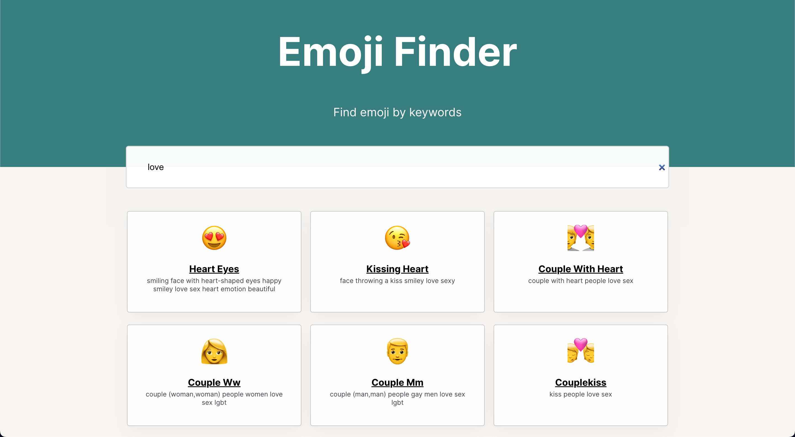

# SeintCode - Emoji Finder

Это учебный проект с онлайн курсов Saind Code 

- [Overview](#overview)
  - [Задача](#the-challenge)
  - [Screenshot](#screenshot)
  - [Ссылки](#links)
  - [Built with](#built-with)
  - [Автор](#author)

## Overview

### The challenge

Цель проетка

  - сверстать
  - выводить карточки со всеми emoji
  - на карточке выводить название и ключевые слова без повторений
  - сделать фильтрацию по ключевым словам
  - сделать чтобы можно было вводить несколько ключевых слов в поле для текста

### Screenshot

### Links

- Live Site URL: https://dorki-coder.github.io/emojiReact/

### Built with

- Semantic HTML5 markup
- CSS custom properties
- Flexbox
- CSS Grid
- [React](https://reactjs.org/) - JS library
- TypeScript

## Author

- GitHub - [@Dorki-coder](https://github.com/Dorki-coder)
